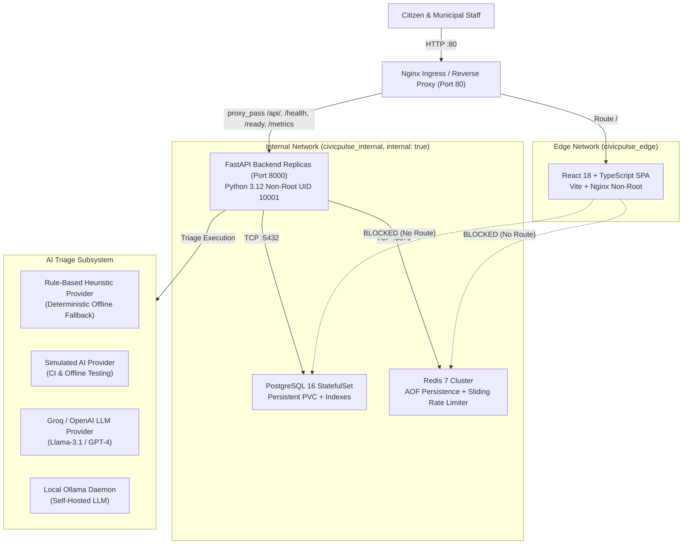

# 🏛️ CivicPulse — Intelligent Civic Issue Triage & Management Platform

[](https://github.com/i243137-oss/CivicPulse/actions/workflows/ci.yml)
[](https://github.com/i243137-oss/CivicPulse/actions/workflows/cd.yml)
[](https://python.org)
[](https://fastapi.tiangolo.com)
[](https://react.dev)
[](https://postgresql.org)
[](https://redis.io)
[](https://kubernetes.io)
[](LICENSE)

---

## 📌 Problem Statement

Municipalities receive hundreds of unstructured citizen reports daily regarding infrastructure failures (water main breaks, electrical hazards, potholes, sanitation backlog). Traditional city reporting systems suffer from:
1. **Intake Latency & Manual Routing**: Days lost manually reading and categorizing civic issues.
2. **Cascading Service Outages**: Dependency on third-party cloud AI APIs causes civic platform downtime when upstream providers fail.
3. **No Abuse or Scraping Protection**: Public portals are susceptible to denial-of-service floods and automated spam.
4. **Lack of Citizen Transparency**: Opaque resolution workflows leave citizens unaware of issue progression.

**CivicPulse** solves these operational bottlenecks by providing an enterprise-grade, resilient, full-stack municipal triage platform. It combines automated heuristic and LLM triage with instantaneous fallback, distributed rate limiting, read-through caching, finite state machine progression, and high-availability Kubernetes autoscaling.

---

## 🏗️ System Architecture

CivicPulse is engineered as a cloud-native, layered monorepo with strict network segmentation and bounded contexts:



---

## 🚀 One-Command Quickstart

Get the complete production-grade CivicPulse stack running locally in under 60 seconds:

```bash
# 1. Clone repository
git clone https://github.com/i243137-oss/CivicPulse.git
cd CivicPulse

# 2. Configure environment with defaults
cp .env.example .env

# 3. Launch full stack with one command
docker compose up -d --build

# 4. Access interfaces:
#    Citizen Portal & Dashboard → http://localhost:80
#    Backend Interactive Docs   → http://localhost:80/docs
#    Prometheus Metrics         → http://localhost:80/metrics
#    Liveness Probe             → http://localhost:80/health
#    Readiness Probe            → http://localhost:80/ready
```

To stop and remove containers cleanly:
```bash
docker compose down -v
```

---

## 🔌 API Contract Reference (All 10 Endpoints)

| Method | Endpoint | Description | Status Codes | Auth / Rate Limit |
| :--- | :--- | :--- | :--- | :--- |
| `POST` | `/api/complaints` | Submit a new civic complaint for automated AI triage | `201 Created`, `422 Validation`, `429 Rate Limit` | Distributed 10 req/min |
| `GET` | `/api/complaints` | Paginated listing with status and category filters | `200 OK`, `422 Validation` | None |
| `GET` | `/api/complaints/{id}` | Retrieve specific complaint by UUID | `200 OK`, `404 Not Found` | None |
| `PATCH`| `/api/complaints/{id}/status` | Execute state machine status transition | `200 OK`, `400 Bad Request`, `409 Conflict` | FSM Transition Table |
| `GET` | `/api/stats` | Summary statistics with read-through Redis cache | `200 OK` (`X-Cache: HIT/MISS`) | Cached 30s TTL |
| `GET` | `/health` | Pure liveness probe (independent of DB/Redis) | `200 OK` | None (Exempt) |
| `GET` | `/ready` | Readiness probe verifying PostgreSQL & Redis | `200 OK`, `503 Unavailable` | None (Exempt) |
| `GET` | `/metrics` | Prometheus telemetry metrics export | `200 OK` | None (Internal) |
| `GET` | `/api/meta/providers` | AI triage provider telemetry, latency, cache hit rate | `200 OK` | None |
| `GET` | `/docs` / `/openapi.json` | Interactive Swagger API documentation | `200 OK` | None |

---

## 📸 User Interface & Operational Views

### 1. Citizen Intake View (`/`)
- Client-side validation enforcing minimum length and valid contact email.
- Honest loading spinner disabling double-clicks during triage inference.
- Real-time result card rendering server-assigned **Category**, **Priority**, **AI Summary**, and **Triage Provider**.

### 2. Operator Management Dashboard (`/complaints`)
- Server-side paginated table with category and status filters.
- Status transition buttons (`In Progress`, `Resolved`, `Rejected`).
- Verbatim surfacing of HTTP `409 Conflict` errors on illegal transitions.

### 3. Analytics & Cache Dashboard (`/dashboard`)
- Aggregate complaint metrics (total, open, in-progress, resolved, rejected).
- Dynamic cache telemetry badge displaying **`X-Cache: HIT`** (green) or **`X-Cache: MISS`** (amber).
- Write-time cache invalidation demonstration.

---

## 🏛️ Infrastructure & Deployment Modes

### Development Mode
```bash
docker compose up --build
```
- Includes live bind mount (`./backend:/app`) for sub-second hot reloading.
- Exposes developer debugging ports (`5432`, `6379`, `8000`).

### Production Compose Mode (Image-Only)
```bash
docker compose -f docker-compose.prod.yml up -d
```
- Zero `build:` directives; pulls immutable images from GHCR (`${IMAGE_TAG}`).
- Zero database or cache port exposure to the host.
- Dual-tier bridge networks (`edge` and `internal: true`).

### Kubernetes Production Cluster
```bash
kubectl apply -k infra/k8s/overlays/prod
```
- Multi-replica Deployments with PodDisruptionBudget (`minAvailable: 1`).
- Horizontal Pod Autoscaling (HPA v2) targeting 60% CPU (2 to 10 replicas).
- PostgreSQL `StatefulSet` with dedicated 2Gi PersistentVolumeClaim.
- Five strict Kubernetes `NetworkPolicy` objects.

---

## 🧪 Testing & Quality Assurance

```bash
# Run backend pytest suite with statement coverage (89% achieved)
cd backend && pytest --cov=app --cov-report=term-missing

# Run frontend Vitest component suite (15 passed tests)
cd frontend && npm test

# Run mechanical pre-submission checker (7/7 passing)
python scripts/check_submission.py
```

---

## 📖 Documentation Index

- [Master Rubric & Evidence Traceability Matrix](docs/EVIDENCE-MAPPING.md)
- [Operational Runbook & Triage Incident Guide](docs/RUNBOOK.md)
- [Engineering Notes & Design Decisions](docs/ENGINEERING-NOTES.md)
- **Timed 5-Minute Video Demonstration Script**: Maintained locally in presenter workspace (`docs/DEMO-SCRIPT.md`)
- [Branch Protection & Collaboration Evidence](docs/evidence/BRANCH-PROTECTION-EVIDENCE.md)
- [Kubernetes HPA Scaling & Load Test Evidence](docs/evidence/HPA-SCALING-EVIDENCE.md)
- [Security Hardening & CVE Audit](docs/evidence/SECURITY-HARDENING-AUDIT.md)
- [Continuous Integration Pipeline Evidence](docs/evidence/CI-PIPELINE-EVIDENCE.md)
- [Continuous Delivery & Rollback Evidence](docs/evidence/CD-DELIVERY-EVIDENCE.md)
- [Production Compose Parity Evidence](docs/evidence/PRODUCTION-COMPOSE-EVIDENCE.md)
- [Architecture Decision Records (ADRs)](docs/adr/)
