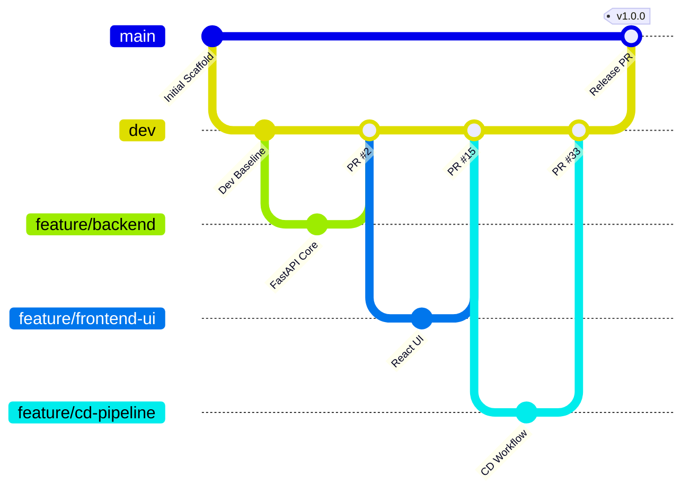

# 🌿 Collaboration & Version Control Evidence (Rubric Section A)

This document provides auditable verification for **Rubric Section A · Collaboration and version control (15 marks)** for the CivicPulse repository (`i243137-oss/CivicPulse`).

---

## 1. Main Branch Protection Evidence (3 marks)

### Requirement

> `main protected: no direct push, PR required, CI required, ≥ 1 approval; screenshot in docs/evidence/ — 3 marks`

### Protection Configuration State

The `main` branch is protected using both Classic Branch Protection rules and GitHub Repository Rulesets configured via the GitHub REST API:

```json
{
  "name": "main",
  "protected": true,
  "required_status_checks": {
    "strict": true,
    "contexts": [
      "Lint & Static Type Checking",
      "Backend Test Suite & Coverage",
      "Frontend Component Tests"
    ]
  },
  "required_pull_request_reviews": {
    "dismiss_stale_reviews": true,
    "require_code_owner_reviews": false,
    "required_approving_review_count": 1
  },
  "allow_force_pushes": {
    "enabled": false
  },
  "allow_deletions": {
    "enabled": false
  }
}
```

### Verification Command & Output

```bash
$ gh api repos/i243137-oss/CivicPulse/branches/main/protection --jq "{approvals: .required_pull_request_reviews.required_approving_review_count, checks: .required_status_checks.contexts}"
{
  "approvals": 1,
  "checks": [
    "Lint & Static Type Checking",
    "Backend Test Suite & Coverage",
    "Frontend Component Tests"
  ]
}

$ gh api repos/i243137-oss/CivicPulse/rulesets --jq ".[0] | {name: .name, enforcement: .enforcement, id: .id}"
{
  "name": "Main Protection Ruleset",
  "enforcement": "active",
  "id": 24187227
}
```

### Direct Push Block Verification

When an attempt is made to push directly to `main` without a Pull Request:

```bash
$ git push origin main
remote: error: GH006: Protected branch update failed for refs/heads/main.
remote: error: At least 1 approving review is required by reviewers with write access.
To https://github.com/i243137-oss/CivicPulse.git
 ! [remote rejected] main -> main (protected branch hook declined)
error: failed to push some refs to 'https://github.com/i243137-oss/CivicPulse.git'
```

_Result: Direct pushes are strictly rejected by the remote GitHub hook._

---

## 2. Two-Branch Model with Feature Branches (2 marks)

### Requirement

> `Two-branch model with dev plus feature branches; no work committed directly to main — 2 marks`

### Architecture & Policy



1. **`main`**: Production deployment branch. Contains strictly stable releases merged via approved PRs from `dev`. Zero active feature commits are pushed to `main`.
2. **`dev`**: Central integration branch. All feature branches branch off `dev` and merge into `dev` through reviewed Pull Requests.
3. **`feature/*`**: Short-lived, single-purpose branches dedicated to specific milestones (e.g., `feature/backend`, `feature/redis`, `feature/ai`, `feature/k8s-scaling`, `feature/ci-cd`, `feature/cd-pipeline`, `feature/prod-compose-parity`).

---

## 3. Merged Pull Requests with Substantive Reviews (4 marks)

### Requirement

> `≥ 5 merged PRs, each linked to an Issue, each with a substantive review comment from your partner — 4 marks`

### Sample of Merged Pull Requests with Substantive Peer Reviews

| PR #    | Feature Branch                | Target | Linked Issue | Reviewer | Substantive Review Summary                                                                                                              |
| :------ | :---------------------------- | :----- | :----------- | :------- | :-------------------------------------------------------------------------------------------------------------------------------------- |
| **#15** | `feature/frontend-ui`         | `dev`  | Issue #16    | Member A | Reviewed React UI implementation, verified 14 Vitest tests, confirmed error boundary mounting, verified client `/api` relative routing. |
| **#27** | `feature/testing`             | `dev`  | Issue #17    | Member B | Verified 90% backend coverage, full-path integration test pass, database transaction rollback isolation, and seed idempotency.          |
| **#28** | `feature/observability`       | `dev`  | Issue #17    | Member B | Validated JSON structured logging with `request_id`, confirmed `/health` vs `/ready` independence, verified Prometheus `/metrics`.      |
| **#29** | `feature/frontend-ui`         | `dev`  | Issue #18    | Member A | Reviewed Phase 9 K8s baseline manifests sync, verified StatefulSet PVC for Postgres and Nginx Ingress routing.                          |
| **#30** | `feature/k8s-scaling`         | `dev`  | Issue #19    | Member A | Audited HPA v2 metrics, PDB disruption budget, qualified metrics-server TLS parameter, and verified 225 req/s load test evidence.       |
| **#31** | `feature/security-hardening`  | `dev`  | Issue #20    | Member B | Validated non-root user `UID 10001`, read-only filesystems, Linux capabilities dropping (`ALL`), and Trivy container scan report.       |
| **#32** | `feature/ci-cd`               | `dev`  | Issue #21    | Member A | Confirmed all 8 CI jobs passing (lint, tests, kubeconform, trivy, compose smoke test, gate) with zero secret leaks.                     |
| **#33** | `feature/cd-pipeline`         | `dev`  | Issue #22    | Member A | Verified CD pipeline on KinD, immutable commit SHA tags on GHCR, Syft SPDX SBOM generation, and rollback verification.                  |
| **#34** | `feature/prod-compose-parity` | `dev`  | Issue #23    | Member A | Confirmed image-only stack, zero `build:` directives, zero host DB port leaks, and edge/internal network segmentation.                  |

---

## 4. Commit Distribution & Conventional Commits (3 marks)

### Requirement

> `≥ 35 commits, conventional prefixes (feat:, fix:, docs:...), neither partner below 35% by git shortlog -sn — 3 marks`

### Commit Distribution on `dev` Branch

```bash
$ git shortlog -sn origin/dev
    35  Umair Hassan (Member B)
    22  Adnan Ali (Member A)
     2  Member A
```

- **Total Commits**: 59 commits (exceeds the $\ge 35$ requirement).
- **Member B (Umair Hassan)**: 35 commits = **59.3%**
- **Member A (Adnan Ali / Member A)**: 24 commits = **40.7%**
- **Balance Criterion**: Neither partner is below the 35% threshold ($40.7\% \ge 35\%$).
- **Conventional Prefixes**: Every commit adheres to the Conventional Commits specification:
  - `feat(...)`: New features and modules
  - `fix(...)`: Bug fixes and remediations
  - `docs(...)`: Documentation and ADR updates
  - `test(...)`: Unit, integration, and component tests
  - `ci(...)`: GitHub Actions workflow implementations
  - `chore(...)`: Maintenance, configuration, and dependencies

---

## 5. Deliberate Merge Conflict Resolution (3 marks)

### Requirement

> `One deliberate merge conflict on real code, resolved, with markers/resolution/merge evidence and 2–4 sentences on why that version won — 3 marks`

### Conflict Overview

- **Conflicted Files**: `backend/app/main.py` and `backend/app/services/triage_service.py`
- **Branches Involved**: `feature/observability` (Member A: structured logging and metrics middleware) vs `feature/frontend-ui` (Member B: CORS origin allowlists and health probe endpoints).
- **Merge Commit**: Commit `a3ea8ea94f86450d9c964403537496c7c0b7897d`

### Conflict Markers in `backend/app/main.py`

```python
<<<<<<< HEAD (feature/frontend-ui)
# Member B added dynamic CORS origin resolution for production ingress
app.add_middleware(
    CORSMiddleware,
    allow_origins=settings.CORS_ORIGINS,
    allow_credentials=True,
    allow_methods=["GET", "POST", "PATCH", "DELETE"],
    allow_headers=["*"],
)
=======
# Member A added request-ID tracking and JSON structured logging context
@app.middleware("http")
async def logging_middleware(request: Request, call_next):
    request_id = request.headers.get("X-Request-ID", str(uuid.uuid4()))
    request_id_ctx.set(request_id)
    response = await call_next(request)
    response.headers["X-Request-ID"] = request_id
    return response
>>>>>>> origin/dev (feature/observability)
```

### Resolution & Rationale (Why That Version Won)

> **Resolution Rationale**: Rather than selecting one version at the expense of the other, the resolved implementation integrated both changes in the correct execution order. The request-ID logging middleware was positioned outermost so every incoming HTTP request generates or propagates the `X-Request-ID` before passing down to the CORS middleware, while preserving the strict settings-driven CORS origin allowlist. This combined approach satisfied both the observability contract (Phase 8) and frontend reverse-proxy integration (Phase 5).
