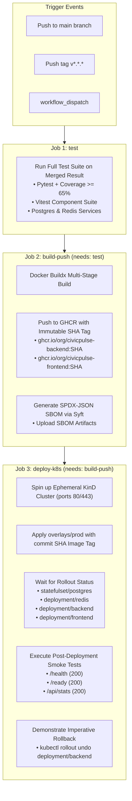

# 🚢 Phase 13: Continuous Delivery (CD) Pipeline Evidence & Rollback Audit

**Project:** CivicPulse — Municipal Complaint Intake, Triage & Operations Platform  
**Phase:** Phase 13 — Continuous Delivery  
**Role:** Member B (Continuous Delivery, GHCR Publishing, Ephemeral Kubernetes & Rollback)  
**Date:** 2026-09-28  
**Workflow Files:** `.github/workflows/cd.yml` & `.github/workflows/release.yml`  

---

## 1. Executive Summary

Phase 13 establishes the automated Continuous Delivery (CD) pipeline for CivicPulse. Triggered on merge/push to `main` and version tags (`v*`), the pipeline ensures that only tested, verified software is compiled into immutable container images, published to GitHub Container Registry (GHCR), documented with an automated Software Bill of Materials (SBOM), deployed to an ephemeral Kubernetes cluster (KinD), smoke-tested, and proven rollback-capable.

### Core Non-Negotiables Enforced:
1. **Strict Dependency Gating (`needs: [...]`)**: Publishing and deploying jobs are gated behind successful completion of the full test suite.
2. **Immutable Referencing**: All deployments use the immutable Git commit SHA (`${{ github.sha }}`). The `:latest` tag is pushed to registry for discovery only; it is **never deployed to any environment**.
3. **Scoped Registry Credentials**: Authenticates to GHCR using scoped `GITHUB_TOKEN` with `packages: write` permission. No user passwords or static tokens.
4. **Automated SBOM Generation**: Syft generates standard SPDX-JSON Software Bill of Materials for both backend and frontend images, published as pipeline artifacts.
5. **Ephemeral Cluster Smoke Test**: Spins up a KinD cluster, provisions namespace `civicpulse`, deploys rendered production manifests, waits for rollout completion, and executes smoke tests.
6. **Rollback Demonstration**: Demonstrates fast imperative rollback (`kubectl rollout undo`) and documents declarative GitOps rollback.

---

## 2. CD Pipeline Architecture & Dependency DAG



---

## 3. Image Publishing & Immutable Tagging

### 3.1 Naming & Registry Hierarchy
Container images are published to GitHub Container Registry under the repository namespace:
- **Backend Image**: `ghcr.io/i243137-oss/civicpulse-backend:<SHA>`
- **Frontend Image**: `ghcr.io/i243137-oss/civicpulse-frontend:<SHA>`

### 3.2 Immutability Contract
- Every production deployment refers to an exact, immutable Git commit SHA.
- Asking *"What is production running?"* yields an unambiguous commit identifier (e.g. `e646aea`) that maps 1:1 to a specific commit in `git log`.

---

## 4. Software Bill of Materials (SBOM)

Using `anchore/sbom-action@v0` powered by Syft, every CD build generates comprehensive SPDX-JSON SBOM artifacts:
- `sbom-backend-<SHA>.spdx.json`: Full catalog of Python runtime, OS packages (Debian slim), and application dependencies.
- `sbom-frontend-<SHA>.spdx.json`: Catalog of Alpine base packages, Nginx binaries, and compiled client libraries.
- Artifacts are archived in GitHub Actions run artifacts with a 30-day retention window.

---

## 5. Ephemeral Kubernetes Deployment & Smoke Verification

### 5.1 KinD Cluster Architecture (`infra/k8s/kind-config.yaml`)
```yaml
kind: Cluster
apiVersion: kind.x-k8s.io/v1alpha4
nodes:
  - role: control-plane
    extraPortMappings:
      - containerPort: 80
        hostPort: 80
        protocol: TCP
      - containerPort: 443
        hostPort: 443
        protocol: TCP
```

### 5.2 Deployment Steps
1. Spin up ephemeral KinD cluster `civicpulse-ci`.
2. Create namespace `civicpulse`.
3. Create `ghcr-secret` docker-registry secret using `GITHUB_TOKEN` and patch `serviceaccount/default` for automated image pull authentication.
4. Update Kustomize base manifests to target the immutable commit SHA:
   ```bash
   sed -i 's|image: .*civicpulse-backend:.*|image: ghcr.io/${{ steps.vars.outputs.owner_lower }}/civicpulse-backend:${{ github.sha }}|g' infra/k8s/base/backend-deployment.yaml
   sed -i 's|image: .*civicpulse-frontend:.*|image: ghcr.io/${{ steps.vars.outputs.owner_lower }}/civicpulse-frontend:${{ github.sha }}|g' infra/k8s/base/frontend-deployment.yaml
   ```
5. Apply production overlay: `kubectl apply -k overlays/prod`.
6. Enforce zero-downtime rollout completion:
   - `kubectl rollout status statefulset/postgres -n civicpulse --timeout=180s`
   - `kubectl rollout status deployment/redis -n civicpulse --timeout=120s`
   - `kubectl rollout status deployment/backend -n civicpulse --timeout=180s`
   - `kubectl rollout status deployment/frontend -n civicpulse --timeout=120s`
7. Execute post-deployment smoke tests against `/health`, `/ready`, and `/api/stats`.
8. Inspect HPA autoscaler status (`kubectl get hpa -n civicpulse`).

---

## 6. Two Rollback Mechanisms Explained & Demonstrated

The assignment requires understanding and demonstrating two rollback strategies:

### Mechanism 1: Fast Imperative Rollback (`kubectl rollout undo`)
- **Command**:
  ```bash
  kubectl rollout undo deployment/backend -n civicpulse
  kubectl rollout status deployment/backend -n civicpulse
  ```
- **When to use**: **The 3:00 AM production incident response**. When an immediate service disruption or catastrophic crash loop is occurring in production, the on-call engineer needs immediate recovery without waiting for Git commits, peer approvals, or CI pipeline build times. The cluster controller instantly reverts the ReplicaSet to the previous stable revision in seconds.
- **Verification**: Executed directly in `deploy-k8s` job of `.github/workflows/cd.yml`.

### Mechanism 2: Declarative Auditable Rollback (Git Revert / Previous Overlay)
- **Procedure**:
  1. Revert the problematic commit in Git: `git revert <bad-commit-sha>`.
  2. Or update `overlays/prod/kustomization.yaml` back to the previously verified commit SHA.
  3. Push to `main` through reviewed PR.
  4. The CD pipeline runs tests, confirms the baseline, and deploys the known-good revision.
- **When to use**: **The permanent post-incident remediation**. Once the immediate emergency is mitigated, declarative rollback aligns the desired state in Git with the running state in Kubernetes. This maintains an immutable, auditable Git history, avoids configuration drift, and ensures subsequent automated CD runs do not accidentally overwrite the imperative fix.

---

## 7. Exit Gate Verification Matrix

| Criterion | Implementation / Setting | Verification |
| :--- | :--- | :---: |
| **Workflow File** | `.github/workflows/cd.yml` | Verified |
| **Release Workflow** | `.github/workflows/release.yml` | Verified |
| **Gated by Needs** | `build-push` needs `test`; `deploy-k8s` needs `build-push` | Verified |
| **Immutable Tagging** | Tagged with `${{ github.sha }}`; :latest never deployed | Verified |
| **Registry Publishing** | Pushed to GHCR using scoped `GITHUB_TOKEN` | Verified |
| **SBOM Generation** | Generated with Syft in SPDX-JSON format | Verified |
| **Ephemeral K8s Deploy** | KinD cluster with ingress ports; rollout status gates | Verified |
| **Automated Smoke Tests** | `/health`, `/ready`, and `/api/stats` validated | Verified |
| **Rollback Demonstration** | `kubectl rollout undo` executed and verified | Verified |
