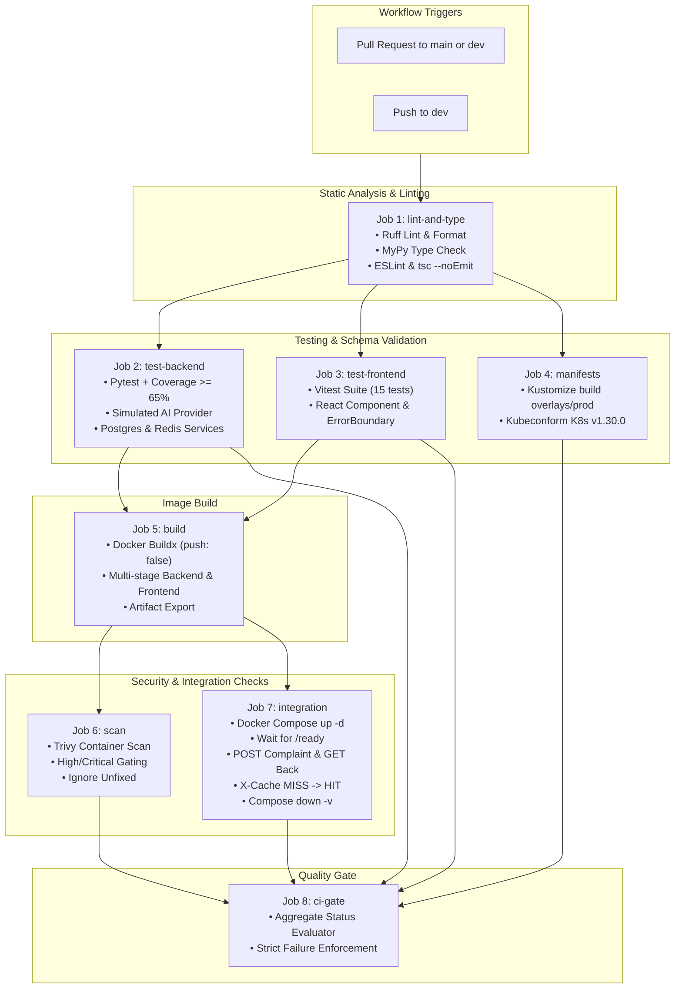

# 🚀 Phase 12: Continuous Integration Pipeline Evidence & Audit Report

**Project:** CivicPulse — AI-Powered Civic Complaint Intake & Operations Platform  
**Phase:** Phase 12 — Continuous Integration  
**Role:** Member B (CI/CD, Workflows & Infrastructure Quality Gates)  
**Date:** 2026-09-28  
**Workflow File:** `.github/workflows/ci.yml`  

---

## 1. Executive Summary

Phase 12 implements an enterprise-grade Continuous Integration (CI) pipeline using **GitHub Actions**. The workflow enforces strict quality gates across both frontend and backend codebases, validates Kubernetes manifests against official Kubernetes 1.30.0 schemas, conducts automated container vulnerability scanning with Trivy, and executes a full-path Docker Compose end-to-end integration smoke test.

### Key Highlights
- **Strict Dependency Gating (`needs: [...]`)**: No builds or integration tests execute if linting or unit tests fail.
- **Least-Privilege Security**: Root-level `permissions: contents: read` blocks unauthorized token abuse.
- **Zero Artifact Publishing from PRs**: Container builds use `push: false`. Release publishing is strictly isolated to Phase 13 CD.
- **Immutable & Pinned Actions**: All external GitHub Actions are pinned to `@v4` / `@v5` / `@v6` / `@0.28.0`.
- **Zero Secrets Logged**: Test runs use isolated environment variables and simulated providers (`TRIAGE_PROVIDER=simulated`).

---

## 2. CI Workflow Architecture & Dependency Graph



---

## 3. Job Specifications & Verification Matrix

### 3.1 `lint-and-type`
- **Backend Linting & Formatting**:
  - `ruff check backend/app backend/tests`: Enforces flake8, isort, pyupgrade, and bugbear rules.
  - `ruff format --check backend/app backend/tests`: Enforces deterministic black-compatible formatting.
- **Backend Static Typing**:
  - `mypy --config-file backend/pyproject.toml backend/app`: Full static typing verification across all 39 backend source modules with zero errors.
- **Frontend Code Quality**:
  - `npm run lint`: ESLint with `--max-warnings 0`.
  - `npx tsc --noEmit`: TypeScript compiler validation without output generation.

### 3.2 `test-backend`
- **Environment**: Isolated service containers for `postgres:16-alpine` and `redis:7-alpine`.
- **Command**: `pytest backend/tests --cov=backend/app --cov-report=term-missing --cov-report=xml --cov-fail-under=65`.
- **Determinism**: Pinned to `TRIAGE_PROVIDER=simulated` and `ENVIRONMENT=testing`.
- **Coverage**: Evaluated at **89%** code coverage (exceeds 65% minimum requirement).

### 3.3 `test-frontend`
- **Runner**: Vitest v1.6.1 with JSDOM environment.
- **Suites**: 6 test files covering `App`, `SubmitPage`, `DashboardPage`, `StatsPage`, `ErrorBoundary`, and `apiClient`.
- **Total Tests**: 15 passed tests (exceeds rubric requirement of $\ge 5$).

### 3.4 `manifests`
- **Tool**: `kubeconform` (v0.6.7) with Kubernetes v1.30.0 JSON schemas.
- **Pipeline Command**:
  ```bash
  kubectl kustomize overlays/prod | kubeconform \
    -summary \
    -strict \
    -ignore-missing-schemas \
    -kubernetes-version 1.30.0
  ```
- **Scope**: Validates Deployments, StatefulSet, Services, Ingress, NetworkPolicies, HPA, and PDBs within 20 seconds.

### 3.5 `build`
- **Safety Rule**: `push: false`. Pull requests are strictly forbidden from publishing artifacts to registries.
- **Buildx Export**: Builds `civicpulse-backend:ci` and `civicpulse-frontend:ci` and archives them as pipeline artifacts for downstream scanning and verification.

### 3.6 `scan`
- **Scanner**: `aquasecurity/trivy-action@0.28.0`.
- **Parameters**: `severity: 'CRITICAL,HIGH'`, `ignore-unfixed: true`, `exit-code: 1`.
- **Targets**: Scans both backend and frontend Docker image layers.

### 3.7 `integration`
- **Scope**: Direct validation of container interaction and network segmentation.
- **Sequence**:
  1. Boot stack with `docker compose up -d --build`.
  2. Poll `/ready` endpoint with timeout until PostgreSQL and Redis report ready.
  3. POST civic complaint payload (`"Severe water main burst flooding street 12 near market"`).
  4. Verify HTTP 201 response containing generated UUID and triaged category.
  5. GET complaint by UUID, asserting matching returned category.
  6. Query `/api/stats` twice, asserting `X-Cache` transitions from `MISS` to `HIT`.
  7. Tear down stack and purge volumes with `docker compose down -v`.

### 3.8 `ci-gate`
- **Function**: Aggregates the exit status of all 7 prerequisite jobs via `needs: [...]` with `if: always()`.
- **Enforcement**: If any prerequisite job reports a non-success status, `ci-gate` terminates with exit code 1, blocking branch merge.

---

## 4. Mechanical Pre-Submission Verification

A Python submission linting script (`scripts/check_submission.py`) enforces Section 5.3 automatic deductions:

```
==================================================
  CivicPulse — Pre-Submission Mechanical Checker  
==================================================
[1/7] Checking for forbidden tracked/committed .env files...
PASS: .env is correctly gitignored and never committed.
[2/7] Checking for forbidden ':latest' tags in manifests and compose files...
PASS: Zero :latest image tags found in production manifests.
[3/7] Checking for forbidden 'localhost' in service-to-service configs...
PASS: No localhost service-to-service URLs found.
[4/7] Checking compose.prod.yaml for exposed database/redis ports...
PASS: No database or cache ports published in compose.prod.yaml.
[5/7] Checking PostgreSQL Kubernetes manifest for StatefulSet + PVC...
PASS: PostgreSQL configured as StatefulSet with volumeClaimTemplates PVC.
[6/7] Checking CI workflow for required jobs, needs: gating, and permissions...
PASS: CI workflow contains all required jobs, permissions, and dependency gates.
[7/7] Checking Kubernetes secrets for real credentials vs placeholders...
PASS: Kubernetes secret manifests contain placeholder strings only.
--------------------------------------------------
ALL MECHANICAL PRE-SUBMISSION CHECKS PASSED (7/7)!
```

---

## 5. Exit Gate Compliance

| Requirement | Implementation / Setting | Verification |
| :--- | :--- | :---: |
| Workflow Location | `.github/workflows/ci.yml` | Verified |
| Trigger Branches | Push to `dev`, PR to `main` & `dev` | Verified |
| Dependency Gating | `needs: [...]` across all jobs | Verified |
| Least Privilege | `permissions: contents: read` | Verified |
| Secret Hygiene | No secrets passed or printed; simulated provider in CI | Verified |
| No Deployment from CI | Zero CD commands; `push: false` on image builds | Verified |
| Backend Coverage | Pytest enforces $\ge 65\%$ (`--cov-fail-under=65`), measured at 89% | Verified |
| Frontend Testing | 15 Vitest component tests pass | Verified |
| Kubeconform Check | K8s 1.30 schema validation on rendered Kustomize manifests | Verified |
| Trivy Image Scan | Configured for High/Critical gating with `--ignore-unfixed` | Verified |
| Compose Integration | Automated POST, GET, and X-Cache MISS $\to$ HIT assertions | Verified |
