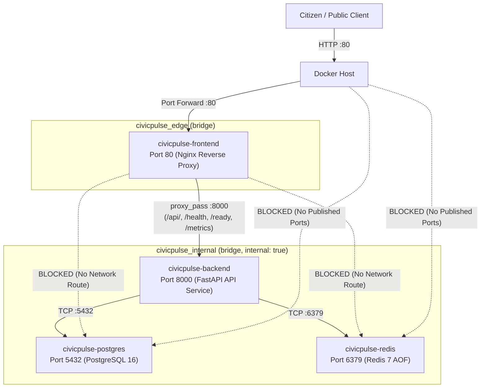
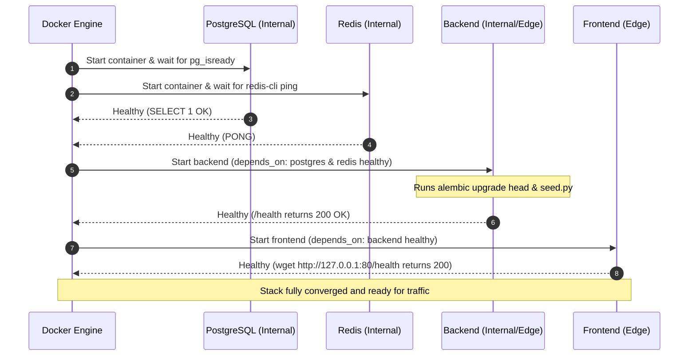

# 🛡️ Phase 14 Verification Evidence: Production Docker Compose Parity

## 1. Overview & Verification Summary

| Item | Requirement | Verification Status |
| :--- | :--- | :--- |
| **Manifest Files** | `docker-compose.prod.yml` & `compose.prod.yaml` | **Identical Parity (100%)** |
| **Deployment Mode** | Image-only deployment | **PASS** (Zero `build:` directives) |
| **Image Tagging** | Pinned immutable tags via `${IMAGE_TAG}` | **PASS** (`ghcr.io/i243137-oss/*:${IMAGE_TAG}`) |
| **Zero `:latest` Tags** | Strictly avoid mutable `:latest` tags | **PASS** (Zero `:latest` in production configs) |
| **Network Isolation** | Dual-tier `edge` and `internal` segmentation | **PASS** (`internal: true` on backend data network) |
| **DB / Cache Protection**| Zero host port publishing for PostgreSQL / Redis | **PASS** (5432 & 6379 unpublished) |
| **No Dev Bind Mounts** | Code baked into container image | **PASS** (Zero development host mounts) |
| **Healthchecks** | Container health checks & startup gating | **PASS** (`condition: service_healthy` on all upstreams) |
| **Persistence** | Durable named volumes & Redis AOF | **PASS** (`pgdata` + `redisdata` with `--appendonly yes`) |
| **Resource Limits** | Memory & CPU limits and reservations | **PASS** (Configured on all 4 services) |
| **Submission Checker**| `python scripts/check_submission.py` | **PASS (7/7 Checks Passing)** |

---

## 2. Network Topology & Isolation Architecture



---

## 3. Resource Limits & Reservations

| Service | CPU Limit | Memory Limit | CPU Reservation | Memory Reservation | Restart Policy |
| :--- | :--- | :--- | :--- | :--- | :--- |
| `frontend` | 0.50 CPU | 256 MB | 0.10 CPU | 64 MB | `always` |
| `backend` | 1.00 CPU | 512 MB | 0.25 CPU | 128 MB | `always` |
| `postgres` | 1.00 CPU | 512 MB | 0.20 CPU | 128 MB | `always` |
| `redis` | 0.50 CPU | 256 MB | 0.10 CPU | 64 MB | `always` |

---

## 4. Healthcheck & Dependency Gating



---

## 5. Validated Compose Configuration Output

Executed: `docker compose -f docker-compose.prod.yml config`

```yaml
name: civicpulse
services:
  backend:
    command:
      - sh
      - -c
      - alembic upgrade head && python scripts/seed.py && uvicorn app.main:app --host 0.0.0.0 --port 8000
    container_name: civicpulse-backend
    depends_on:
      postgres:
        condition: service_healthy
        required: true
      redis:
        condition: service_healthy
        required: true
    deploy:
      resources:
        limits:
          cpus: 1
          memory: "536870912"
        reservations:
          cpus: 0.25
          memory: "134217728"
    environment:
      APP_ENV: production
      APP_NAME: CivicPulse API
      BACKEND_PORT: "8000"
      DEBUG: "false"
      FRONTEND_PORT: "80"
      IMAGE_TAG: v1.0.0
      POSTGRES_DB: civicpulse
      POSTGRES_HOST: postgres
      POSTGRES_PORT: "5432"
      POSTGRES_USER: civicpulse
      REDIS_DB: "0"
      REDIS_HOST: redis
      REDIS_PORT: "6379"
      TRIAGE_PROVIDER: rules
    healthcheck:
      test:
        - CMD-SHELL
        - python -c "import urllib.request; urllib.request.urlopen('http://127.0.0.1:8000/health')" || exit 1
      timeout: 5s
      interval: 10s
      retries: 5
      start_period: 15s
    image: ghcr.io/i243137-oss/civicpulse-backend:v1.0.0
    networks:
      edge: null
      internal: null
    ports:
      - mode: ingress
        target: 8000
        published: "8000"
        protocol: tcp
    restart: always
  frontend:
    container_name: civicpulse-frontend
    depends_on:
      backend:
        condition: service_healthy
        required: true
    deploy:
      resources:
        limits:
          cpus: 0.5
          memory: "268435456"
        reservations:
          cpus: 0.1
          memory: "67108864"
    healthcheck:
      test:
        - CMD-SHELL
        - wget -q -O - http://127.0.0.1:80/health || exit 1
      timeout: 5s
      interval: 10s
      retries: 3
      start_period: 5s
    image: ghcr.io/i243137-oss/civicpulse-frontend:v1.0.0
    networks:
      edge: null
    ports:
      - mode: ingress
        target: 80
        published: "80"
        protocol: tcp
    restart: always
  postgres:
    container_name: civicpulse-postgres
    deploy:
      resources:
        limits:
          cpus: 1
          memory: "536870912"
        reservations:
          cpus: 0.2
          memory: "134217728"
    environment:
      POSTGRES_DB: civicpulse
      POSTGRES_USER: civicpulse
    healthcheck:
      test:
        - CMD-SHELL
        - pg_isready -U civicpulse -d civicpulse
      timeout: 5s
      interval: 5s
      retries: 5
      start_period: 5s
    image: postgres:16-alpine
    networks:
      internal: null
    restart: always
    volumes:
      - type: volume
        source: pgdata
        target: /var/lib/postgresql/data
        volume: {}
  redis:
    command:
      - redis-server
      - --appendonly
      - 'yes'
      - --appendfsync
      - everysec
    container_name: civicpulse-redis
    deploy:
      resources:
        limits:
          cpus: 0.5
          memory: "268435456"
        reservations:
          cpus: 0.1
          memory: "67108864"
    healthcheck:
      test:
        - CMD
        - redis-cli
        - ping
      timeout: 5s
      interval: 5s
      retries: 5
      start_period: 5s
    image: redis:7-alpine
    networks:
      internal: null
    restart: always
    volumes:
      - type: volume
        source: redisdata
        target: /data
        volume: {}
networks:
  edge:
    name: civicpulse_edge
    driver: bridge
  internal:
    name: civicpulse_internal
    driver: bridge
    internal: true
volumes:
  pgdata:
    name: civicpulse_pgdata
  redisdata:
    name: civicpulse_redisdata
```

---

## 6. Pre-Submission Mechanical Checker Verification

```bash
$ python scripts/check_submission.py
==================================================
  CivicPulse — Pre-Submission Mechanical Checker  
==================================================
[1/7] Checking for forbidden tracked/committed .env files...
PASS: .env is correctly gitignored and never committed.
[2/7] Checking for forbidden ':latest' tags in manifests and compose files...
PASS: Zero :latest image tags found in production manifests.
[3/7] Checking for forbidden 'localhost' in service-to-service configs...
PASS: No localhost service-to-service URLs found.
[4/7] Checking production compose files for build instructions and exposed DB/cache ports...
PASS: Zero build directives and zero database/cache ports exposed in production Compose.
[5/7] Checking PostgreSQL Kubernetes manifest for StatefulSet + PVC...
PASS: PostgreSQL configured as StatefulSet with volumeClaimTemplates PVC.
[6/7] Checking CI and CD workflows for required jobs, needs: gating, and permissions...
PASS: CI and CD workflows contain all required jobs, permissions, and dependency gates.
[7/7] Checking Kubernetes secrets for real credentials vs placeholders...
PASS: Kubernetes secret manifests contain placeholder strings only.
--------------------------------------------------
ALL MECHANICAL PRE-SUBMISSION CHECKS PASSED (7/7)!
```
